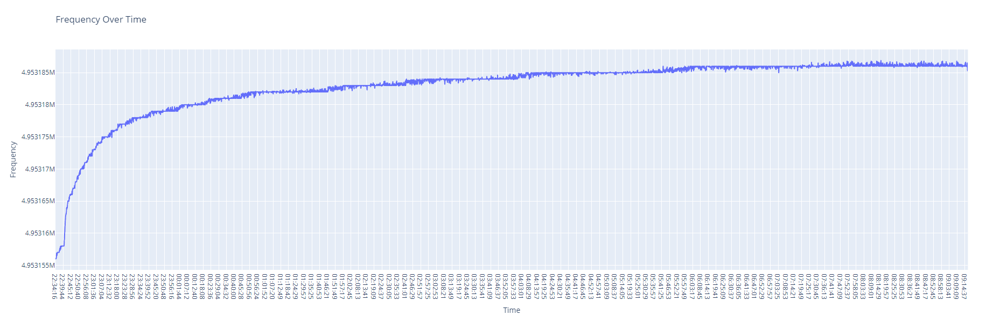
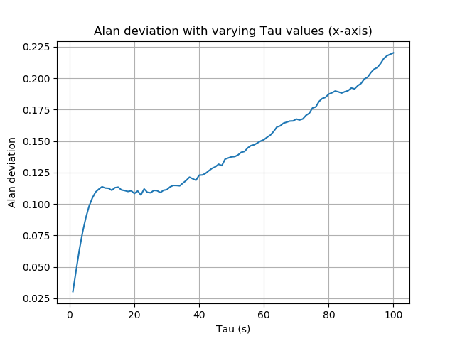

# A Graphical Interface to Interpretate Data from QCM Sensors
## Frequency Test 1

## Current Standard Deviation is 4.58 and Alan Deviation Varies overtime

# Dashboard Roadmap

- [] Sauerbrey equation
- [] Gordon Kanawaza
- [] Realtime data parsing
- [] Dashboard metrics

# Colloquium 2 Objective.

- Correlate stability with Quality factor.
- Graph with Allan deviation plotted against several sampling times.
   
  Summary:
   
- The Allan variance is intended to estimate stability due to noise processes and not that of systematic errors or
  imperfections such as frequency drift or temperature effects.  
   
- A low Allan variance is a
  characteristic of a clock with good stability over the measured period.
- The M-sample variance is a measure of frequency stability using M samples, time T between measures and observation time tau. M-sample variance is expressed as sigma^2 = (M,T,tau)/
- Allan deviation = sqrt(sigma^2)

## Roadmap Allan deviation graph.

- Research allan deviation.
- Calculate allan deviation on the test1.csv file.
- Calculate allan deviation for the Roomtemp.txt file.
- Plot the allan deviation against varied sampling times.

## Helpful links and documents:

- [Allan variation / deviation, introduction](http://home.engineering.iastate.edu/~shermanp/AERE432/lectures/Rate%20Gyros/Allan%20variance.pdf)
- [Allan tools package, github](https://pypi.org/project/AllanTools/)

## Notes meeting 4 November.

### Q-factor graph.

On a Q factor graph, the y-axis the conductance, and the x axis is the frequency.
3dB = Amplitude/sqrt(2)
Q=f0/df
where df is the x-axis point where the 3db line crosses the graph.

### Analysis.

Several metrics should be analyzed:

- Standard deviation.
- Allan deviation. Go to allenstein.com

### System Drift.

Our measurements encounter system drift. Heat is generated by the chips and the QCM. This difference in temperature influences the measured values.
This is due to the environment warming up and environmental equilibrium.
